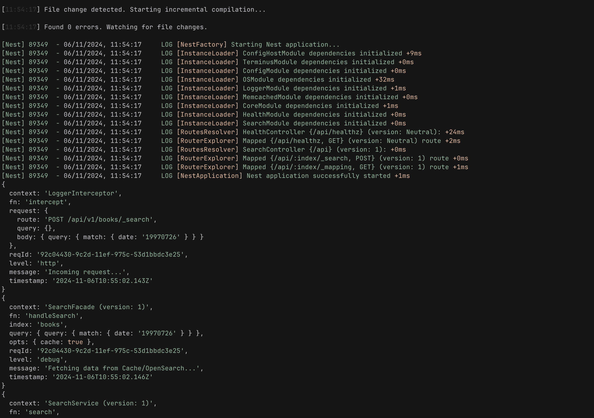

<div align="center">
  <p>
    
    <b></b>
    
  </p>
  <p>
    Logger module and service for <a href="https://github.com/nestjs/nest" target="blank">Nest</a>,<br>
    a progressive Node.js framework for building efficient and scalable server-side applications.
  </p>
  <p>
    <a href="https://www.npmjs.com/@andreafspeziale/nestjs-log" target="_blank"></a>
    <a href="https://www.npmjs.com/@andreafspeziale/nestjs-log" target="_blank"></a>
    <a href="https://github.com/andreafspeziale/nestjs-log/actions" target="_blank"></a>
  <p>
</div>

## Installation

### npm

```sh
npm install @andreafspeziale/nestjs-log
```

### yarn

```sh
yarn add @andreafspeziale/nestjs-log
```

### pnpm

```sh
pnpm add @andreafspeziale/nestjs-log
```

## How to use?

### Module

The module is <a href="https://docs.nestjs.com/modules#global-modules" target="blank">Global</a> by default.

#### LoggerModule.forRoot(options)

`src/core/core.module.ts`

```ts
import { Module } from '@nestjs/common';
import { LoggerModule } from '@andreafspeziale/nestjs-log';

@Module({
  imports: [
    LoggerModule.forRoot({
      level: LoggerLevel.Error,
      customLevelsOrder: false
      pretty: true,
      colorize: false,
      redact: ['password'],
      exclude: ['/swagger'] // Exclude routes from LoggerInterceptor
    }),
  ],
  ...
})
export class CoreModule {}
```

- `level` is optional and its default is `Debug`
- `customLevelsOrder` is optional and its default is `false` (Enables a personal levels hierarchy taste)
- `pretty` is optional and its default is `true`
- `colorize` is optional and its default is `true`
- `redact` is optional and its default is []
- `exclude` is optional and its default is []

<p align="center">
  
</p>

BTW, by using defaults you can ignore the provided schemas described in the "Environment variables management" chapter and just:

```ts
export const loggerModuleOptions = {
  level: LoggerLevel.Debug,
  customLevelsOrder: false,
  pretty: true,
  colorize: true,
  redact: [],
  exclude: [],
};
```

`src/core/core.module.ts`

```ts
import { Module } from '@nestjs/common';
import { LoggerModule } from '@andreafspeziale/nestjs-log';

@Module({
  imports: [
    LoggerModule.forRoot({}),
  ],
  ...
})
export class CoreModule {}
```

#### LoggerModule.forRootAsync(options)

`src/core/core.module.ts`

```ts
import { Module } from '@nestjs/common';
import { ConfigModule, ConfigService } from '@nestjs/config';
import { LoggerModule } from '@andreafspeziale/nestjs-log';
import { Config } from './config';

@Module({
  imports: [
    ConfigModule.forRoot({
      ....
    }),
    LoggerModule.forRootAsync({
      useFactory: (cs: ConfigService<Config, true>) => cs.get<ConfigService['logger']>('logger'),
      inject: [ConfigService],
    }),
  ],
  ....
})
export class CoreModule {}
```

### Decorators

> use the client and create your own service

#### InjectLoggerOptions() and InjectLogger()

`src/samples/samples.service.ts`

```ts
import { Injectable } from '@nestjs/common';
import {
  InjectLoggerOptions,
  InjectLogger,
  LoggerClient,
  LoggerModuleOptions,
  LoggerClient,
} from '@andreafspeziale/nestjs-log';

@Injectable()
export class SamplesService {
  constructor(
    @InjectLoggerOptions()
    private readonly loggerModuleOptions: LoggerModuleOptions, // Showcase purposes
    @InjectLogger() private readonly loggerClient: LoggerClient
  ) {}

  ....
}
```

### Service

> out of the box service with a set of features

#### LoggerService

`src/samples/samples.service.ts`

```ts
import { LoggerService } from '@andreafspeziale/nestjs-log';
import { SampleReturnType, MyParams } from './samples.interfaces'

@Injectable()
export class SamplesService {
  constructor(
    private readonly loggerService: LoggerService
  ) {
    this.logger.setContext(SamplesService.name);
  }

  async sampleMethod(params: MyParams): Promise<SampleReturn> {
    this.logger.debug('Doing something...', {
      fn: this.sampleMethod.name,
      params,
    });

    ....
  }
}
```

You'll see:

```sh
{
  context: 'SamplesService',
  fn: 'sampleMethod',
  params: {
    ....,
  },
  reqId: '557a8e30-62e6-11ef-b821-ebc5f38e9e30',
  level: 'debug',
  message: 'Doing something...',
  timestamp: '2024-08-25T13:31:28.843Z'
}
```

`reqId` will be there as soon as you developing a backend server and:

`src/main.ts`

```ts
import { rTracerFastifyMiddleware } from '@andreafspeziale/nestjs-log';

async function bootstrap() {
  const app = await NestFactory.create....;

  ....

  // I usually use Fastify but feel free to use Express importing rTracerExpressMiddleware instead of rTracerFastifyMiddleware
  app.use(rTracerFastifyMiddleware());

  ....

  await app.listen....;
}
bootstrap();
```

### Middleware or Interceptor?

Use `middleware` in case of `Express`, use interceptor in case of `Fastify`.

At each request you'll see something like this:

```sh
{
  context: 'LoggerInterceptor',
  fn: 'intercept',
  request: {
    route: 'POST /whatever',
    query: {},
    body: {
      ....
    }
  },
  reqId: '557a8e30-62e6-11ef-b821-ebc5f38e9e30',
  level: 'http',
  message: 'Incoming request...',
  timestamp: '2024-08-25T13:31:28.798Z'
}
```

#### Middleware

`src/core/core.module.ts`

```ts
import { LoggerMiddleware, LoggerModule } from '@andreafspeziale/nestjs-log';
import { MiddlewareConsumer, Module, NestModule } from '@nestjs/common';

@Module({
  imports: [
    ....,
    LoggerModule....
  ],
  providers: [....],
})
export class CoreModule implements NestModule {
  configure(consumer: MiddlewareConsumer): void {
    consumer
      .apply(LoggerMiddleware)
      .exclude('(.*)/healthz', '/swagger(.*)', '/favicon.ico')
      .forRoutes('*');
  }
}
```

#### Interceptor

`src/samples/samples.controller.ts`

```ts
import { Body, Controller, Post, UseInterceptors } from '@nestjs/common';
import { LoggerInterceptor } from '@andreafspeziale/nestjs-log';
import { MyPayloadDTO, MyReturnDTO } from './dto';
import { SamplesService } from './samples.service';

@Controller('samples')
@UseInterceptors(LoggerInterceptor)
export class SearchController {
  constructor(private readonly samplesService: SamplesService) {}

  @Post()
  async search(@Body() payload: MyPayloadDTO): Promise<MyReturnDTO> {
    return this.samplesService.sampleMethod(payload);
  }
}
```

or

`src/core/core.module.ts`

```ts
import { LoggerInterceptor, LoggerModule } from '@andreafspeziale/nestjs-log';
import { Module } from '@nestjs/common';
import { APP_INTERCEPTOR } from '@nestjs/core';

@Module({
  imports: [
    ....,
    LoggerModule.... // Use the "exclude" module option to exclude routes from LoggerInterceptor
  ],
  providers: [{
    provide: APP_INTERCEPTOR,
    useClass: LoggerInterceptor,
  }],
})
export class CoreModule {}
```

### Environment variables management

Please refer to <a href="https://github.com/andreafspeziale/nestjs-search" target="blank">`@andreafspeziale/nestjs-search`</a> for more info about the environment variables features exported from my packages.

`nestjs-log` exports some features as well.

#### Zod

```ts
import { loggerSchema } from '@andreafspeziale/nestjs-log/dist/zod';

....
```

#### Class transformer/validator

```ts
import { LoggerSchema, ILoggerSchema } from '@andreafspeziale/nestjs-search/dist/class-validator';

....
```

## Test

- `pnpm test`

## Stay in touch

- Author - [Andrea Francesco Speziale](https://twitter.com/andreafspeziale)
- Website - [https://nestjs.com](https://nestjs.com/)
- Twitter - [@nestframework](https://twitter.com/nestframework)

## License

nestjs-log [MIT licensed](LICENSE).
